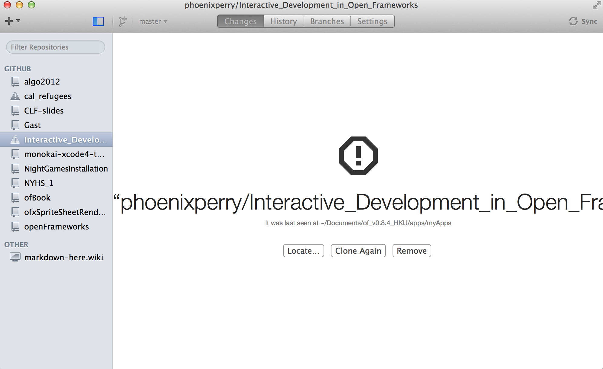
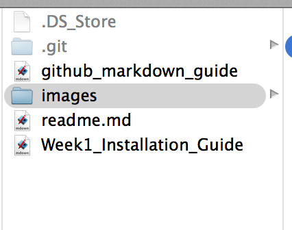
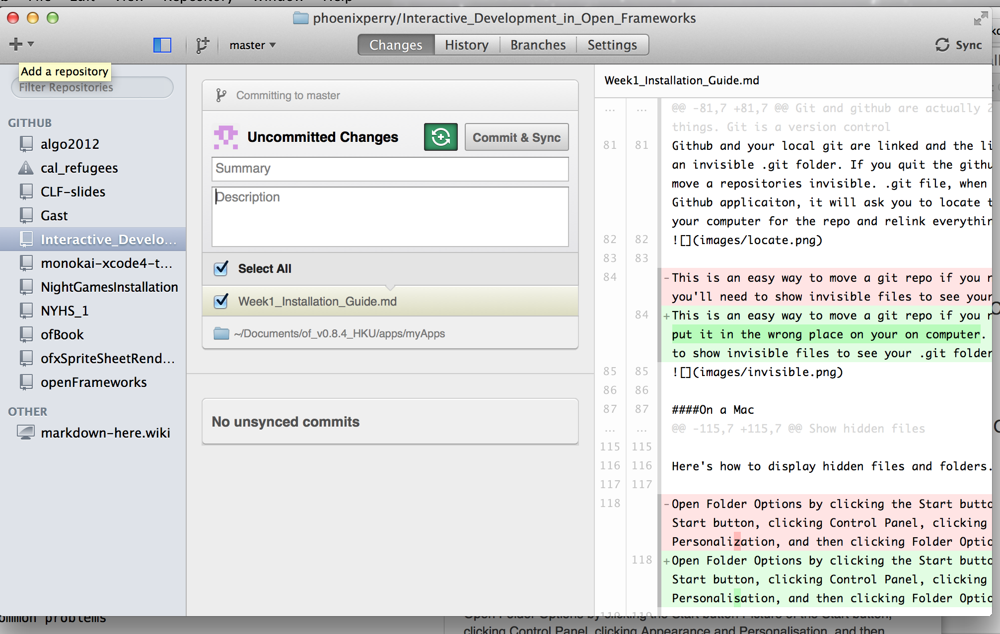
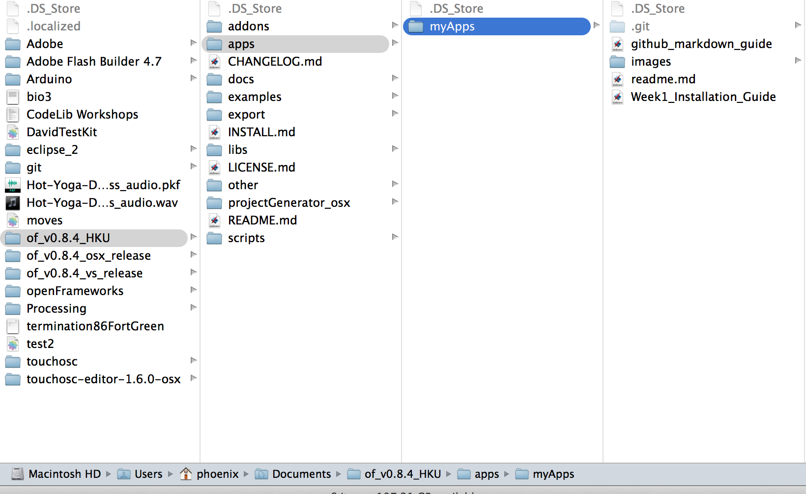
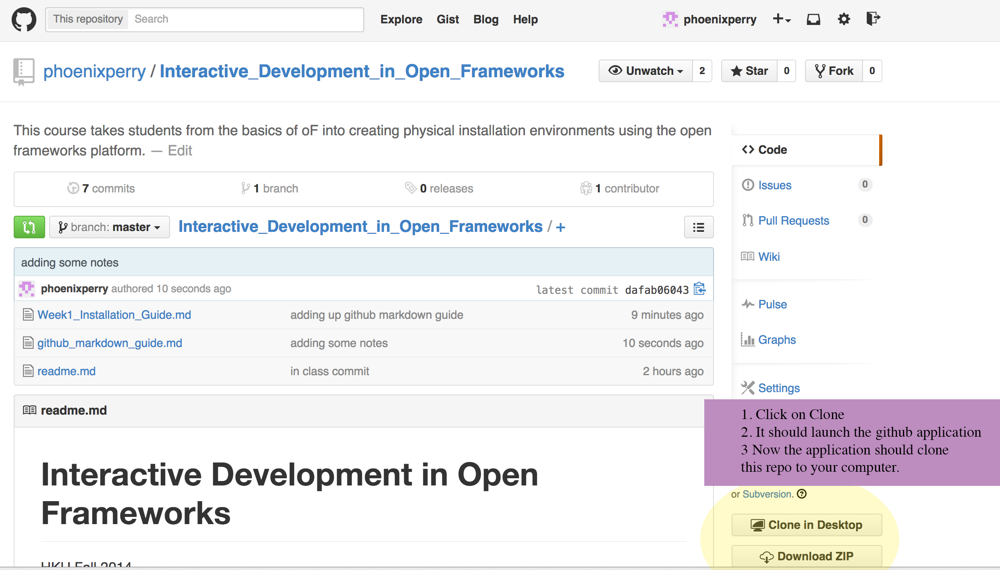
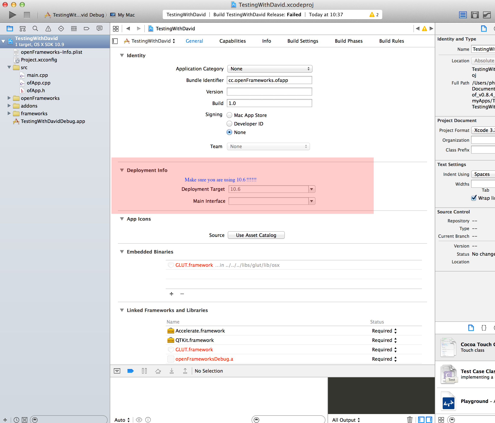

#Installing all of the software you need for this class 

Some helpful terms from today: 
 
1. IDE 
Integrated Development Environment 
The program that will compile all of your code files into an executable file. 

2. Compiler 
Computers cannot directly understand programming languages like C++ and Java, the must first be converted into the underlying machine language, a process called compiling.
Your code > Compiler > Machine language

What is machine language? 
<http://simple.wikipedia.org/wiki/Machine_code>

3. Memory management 
C++ lets you manage a computer's memory directly. This process is called memory management 
 
4. Open Frameworks

(from <http://www.openframeworks.cc/about>)

openFrameworks is an open source C++ toolkit designed to assist the creative process by providing a simple and intuitive framework for experimentation. The toolkit is designed to work as a general purpose glue, and wraps together several commonly used libraries, including:

OpenGL, GLEW, GLUT, libtess2 and cairo for graphics
rtAudio, PortAudio or FMOD and Kiss FFT for audio input, output and analysis
FreeType for fonts
FreeImage for image saving and loading
Quicktime and videoInput for video playback and grabbing
Poco for a variety of utilities
The code is written to be massively cross-compatible. Right now we support five operating systems (Windows, OSX, Linux, iOS, Android) and four IDEs (XCode, Code::Blocks, and Visual Studio and Eclipse). The API is designed to be minimal and easy to grasp.

Simply put, openFrameworks is a tool that makes it much easier to make things with code. We find it super useful, and we hope you do too.

openFrameworks is actively developed by Zach Lieberman, Theodore Watson, and Arturo Castro, with help from the OF community. openFrameworks is indebted to two significant precursors: the Processing development environment, created by Casey Reas, Ben Fry and the Processing community; and the ACU Toolkit, a privately distributed C++ library developed by Ben Fry and others in the MIT Media Lab's Aesthetics and Computation Group.

5. Git
Git is a Version Control system that allows developers to keep versions of the code and refer to them. They can easily go back to previous versions of their own code and collaborate with other developers seamlessly.  

#And now for the tricky bit

You will need 3 pieces of software:
Open Frameworks, an IDE for your computer (Visual Studio or XCode) and github.  

##1. Open Frameworks 
Open frameworks is an open source creative coding framework. It standardises many c++ libraries' syntax, such as quicktime and openCV, into a common format that's easy to read and understand.

What can you make in open frameworks and why would you want to learn it? 

<http://vimeo.com/74124094>
 
###Windows: 
1. Download Open Frameworks for windows:
<http://openframeworks.cc/download/>
(This is for 0.8 - should be the same as 0.84. Email me issues please! I'll work on this more later but I wanted to get something up today!)

2. Follow the open frameworks installation for visual studio guide coming soon! 

###Mac: 
1. Download Open Frameworks for windows: 
<http://openframeworks.cc/download/>

2. Follow the open frameworks installation for mac 
<http://openframeworks.cc/setup/xcode/>

##2. Github
Github is a collection of many hosted git projects on a website. It's got something in common with facebook and also with dropbox. You can follow other developers and also make your code public. Also, it allows developers to share code, however we are not going to cover this just yet. 

Mac
<https://mac.github.com/>

Windows 
<https://windows.github.com/> 

You must create a github repository in your work in this class. 

Let's learn a bit about github. 

####Vocabulary 
Words People Use When They Talk About Git

In this class, there are a few words I’m going to use repeatedly, none of which I'd heard before I started learning. Here’s the big ones:

####Command Line: 
The computer program we use to input Git commands outside the github application. On a Mac, it’s called Terminal. On a PC, it’s a non-native program that you download when you download Git for the first time (we’ll do that in the next section). In both cases, you type text-based commands, known as prompts, into the screen, instead of using a mouse.

####Repository: (a repo) 
A directory or storage space where your projects can live. Sometimes GitHub users shorten this to “repo.” It can be local to a folder on your computer, or it can be a storage space on GitHub or another online host. You can keep code files, text files, image files, you name it, inside a repository.

####Version Control: 
Basically, the purpose Git was designed to serve. When you have a Microsoft Word file, you either overwrite every saved file with a new save, or you save multiple versions. With Git, you don’t have to. It keeps “snapshots” of every point in time in the project’s history, so you can never lose or overwrite it.

####Commit: 
This is the command that gives Git its power. When you commit, you are taking a “snapshot” of your repository at that point in time, giving you a checkpoint to which you can reevaluate or restore your project to any previous state.

This definitions are from a tutorial that we aren't going to cover just now but feel free to check it out and know we will get there.  <http://readwrite.com/2013/09/30/understanding-github-a-journey-for-beginners-part-1> 

Here are a few more! 

####Push: 
This means you are going to save your code and local commits up to the internet. You "push" your code to github. This happens when you press the sync or sync and commit button in the Github application 

####Pull: 
Pulling code means you update your local codebase to match what is currently up in the same repository living on github.com. Usually, this will be someone else's repo. For example you will want to often pull the class repository to keep your local copies of my repository up-to-date. This will give you access to the code that I write for the class. 

####Sync: 
If you sync from the github application, it will first pull the code from the repo on github.com (this is important if you are co-authoring a piece of code with a team) and then push your local commits to the site. 

## Invisible files and github 
Git and github are actually 2 totally different things. Git is a version control system for developers that can live on any server. Github is a website service that stores millions of gits in a public place. Aka git is the tool and github is actually the application, service and website. 

Github and your local git are linked and the link is established in an invisible .git folder. If you quit the github application and move a repositories invisible. .git file, when you restart the the Github applicaiton, it will ask you to locate the new folder on your computer for the repo and relink everything for you. Click the locate button and navigate to the new location of the .git file in your open frameworks > apps > myapps folder and it will now reconnect.

This is an easy way to move a git repo if you need to because you put it in the wrong place on your on computer. However, you'll need to show invisible files to see your .git folder. 

####On a Mac 

1. Open Finder

2. Open the Utilities folder

3. Open a terminal window

4. Copy and paste the following line in:

`SUDO defaults write com.apple.Finder AppleShowAllFiles YES; killall Finder`

The do the follow 

5. Press return
6. Enter your administrator password when prompted
7. Press return

You should find the finder window will disappear, along with the icons on your desktop. However, if you now launch a new finder instance you will now be able to see any hidden files or folders. Once you are done, perform the steps above however, replace the terminal command in step 4 with:

`SUDO defaults write com.apple.Finder AppleShowAllFiles NO; killall Finder`

If the above is not working for you, you may want to try switching YES/NO to TRUE/FALSE .. Beware that this is case-sensitive!

defaults write com.apple.Finder AppleShowAllFiles TRUE

####On windows 
Show hidden files

Here's how to display hidden files and folders.

Open Folder Options by clicking the Start button Picture of the Start button, clicking Control Panel, clicking Appearance and Personalisation, and then clicking Folder Options.

Click the View tab.

Under Advanced settings, click Show hidden files, folders, and drives, and then click OK.

#### How to create a repository for all of your openframeworks projects for this class 

1. Open the Github application you installed. 
2. Click on the + sign to add a new repo 

3. For now just create a repo anywhere. We will be moving it into the right place in our next few steps. DO NOT use spaces in your repo names. You will hate yourself later. In fact, never do this with any programming files. 
4. Show invisible files for your system
5. Quit the github application 
6. Go to where you created the repo on your hard drive. For example, if you made a repo called myCode on your desktop go there. Leave this window open and move to step 7.
7. In a separate window, open your open frameworks folder. this will be living wherever you downloaded it. 
8. Navigate through this tree structure. Drag the invisible .git file from your other open window from step 7into this folder. Notice how I have a few versions of open frameworks in my documents folder. This is totally ok! You can do this. In fact, you often will. I just appended the my folder for open frameworks to have HKU so I would know it would have my specific projects for this class. You can do this too if you want to have code that you do not want in your class repo. Just duplicate the open frameworks root folder and rename it in whatever way suits your fancy. I do suggest keeping a note on the file of which version of open frameworks is in the folder though as they do change quite often and new versions of this software often come out. 
 

##### Cloning the class repository 
You will want to clone my repository for this class. To do this. 
1. Open your github application 
2. Go to this Url
<https://github.com/phoenixperry/Interactive_Development_in_Open_Frameworks>
3. Clone the repo. Use this image as a reference 

4. Every week, if you will be able to pull my new updates and get the new code and notes for the class.  

#Now let's try and compile an open frameworks project! 
If this goes well, you will see a solid grey window pop up. If it works, yeah! If not, proceed to the problems section below. 

1. Go to XCode or Visual studio 

2. Open your project file 

If you are on a mac: 
From xcode go to 
File > Open > [where you put your open frameworks build] > apps > myapps > empty example 
 

If you are on windows: 
MORE SOON 

####Common IDE problems 

### Mac 
I get all kinds of poco or GLUT errors and it looks like xcode freaked out when I clicked the play (run) button. 
1. XCode is targeting the wrong version of the mac sdk 
 

Nothing happened! It built and no grey window opened. 
2. You are not building the empty example project in open frameworks. Change the build target. 

### Windows
More soon here! There should be more documentation on this stuff than there is online. I'm sorry I can't just point you all somewhere but move through this 

