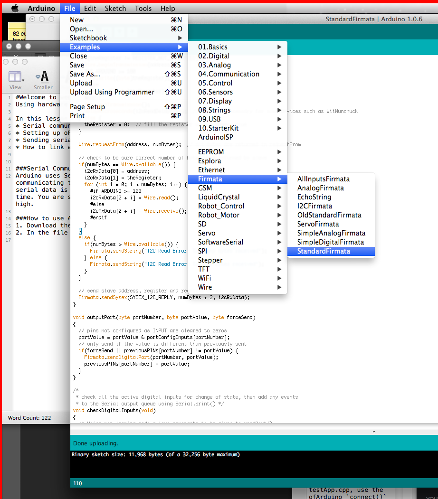
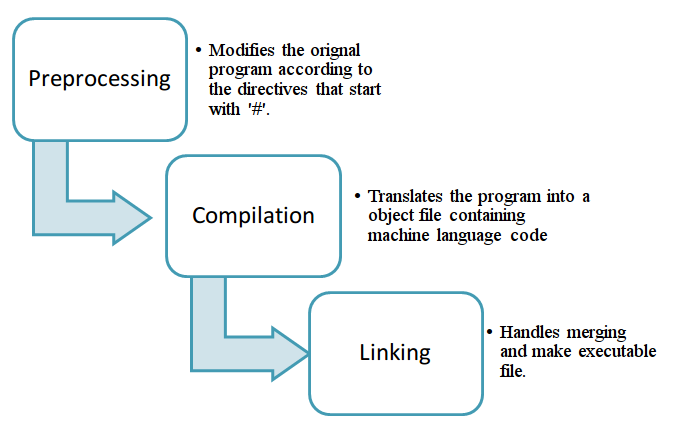

#Welcome to week 3!
Using hardware in OpenFrameworks 

In this lesson we are going to cover 
* Serial communication with arduino  
* Setting up oF to work with Arudino 
* Sending serial communication to Open Frameworks 
* How to link a button to an onscreen graphics 

###Serial Communication with Arduino
Arduino uses Serial data to communicate. Serial communication refers to communicating things one after another, in the most broad terms. This is what serial data is - communication between two entities being sent one bit at a time. You are sending either a 0 or a 1. In Arduino terms, 0 is LOW and 1 is high. 

###How to use Arduino with Open Frameworks  in a *very* simple game 
* Download the Arduino enviroment from <http://Arduino.cc.
* In the file menu, go to File > Examples > Firmata > StandardFirmata 

* With your Arduino plugged in, make sure under Tools>Boards you select your Arduino. Under Tools>Serial Port make sure you have a corresponding port. Usually this will be a usb port. In my case it was /dev/tty.usbmodem1421

* Press the forward arrow in the Arduino IDE in the blue bar across the top. It will go yellow when you rollover it. What this does is sets up the inputs and outputs of the Arduino to send and receive serial data. Now when we go back to oF, we can address those ports and set them to send or receive as we desire. 

* Open up an oF project. You can use project generator to create it. 

* We are going to create a few variables and function prototypes in ofApp.h to use in ofApp.app. Open it now and add the code that's in the week3 folder ofApp.h file. Note we are building on last weeks' code so you'll have the game code mostly in place already. There are a few new things, such as sound and images we've added for this week you'll also need to add. 

* Next go and the code in ofApp.cpp. Everything is heavily commented as to what it does. 

*** Note this is not the proper way to use Arduino. It's the fast way. However, I did want you guys to get up and running with Ardunio before we have a chance to cover pointers and references so this is what we are going to do for now ***  

##Concepts from this week. 
1. Header files. 
	Header files in C++ are used to keep a list of your includes, variables and function prototypes. Variables and functions are grouped and are also listed with their privacy levels of public, private or protected. 
	
	Function prototypes simply alert the compiler you will be defining a function later and to look for it should the need arise. It will look just like the first line of your function later on, only end with a semicolon right after the function arguments. 
	For example: 
	
        void myFunction(int x)
   
   
        {
	        cout << x; 
            
   		}

	Has the function prototype:  `void myFunction(int x);`  

2. .cpp Files
	These files include all for your logic and implementation. 
	

So the story I told you in class was the short version of what *really* happens. However, there's a longer tale. The preprocessor is, in reality, a first step in a much longer process. It simply goes through and replaces all of your #define and #include statements with c++ code. From there, the compiler comes in and makes every file into an object and then your linker links them all up and translates everything down into an executable your computer can run. 

Include statements you've already seen and they look like this: 

`#include "aFileHere.h"`
The preprocessor goes and gets that file and puts it at the top of your code. Simple enough. 

We are not going to talk much about #define statements but they are just short hand that c++ will translate into code for you . For example: 
	
	#define MY_NAME  "Alex"
	cout << "Hello, " << MY_NAME << endl;

becomes: 
	#define MY_NAME  "Alex"
	cout << "Hello, " << "Alex" << endl;
once the preprocessor has it's way with it. 

This is a define statement's form 
`#define identifier replacement`

There is one other kind of define statement that's worth knowing about, conditional compilation. 

The #ifdef preprocessor directive allows the preprocessor to see whether a value has been already been #defined. If it has, it will not replicate the code again. 

Because of the way header files work, it's possible to end up with multiple copies of the same code once the preprocessor has done it's magic. To avoid this, we use this kind of conditional check.  

    #ifndef ADD_H
    #define ADD_H
    
    // your declarations here
    
    #endif
    
When we get to making your own classes, we will touch on this again, but it's safe to say all your headers should include some conditional check to make sure they have not already been added. More coming on this! 

That wasn't even close to the longest version of the story! 

 

For more reading with deeper explaination:

<http://www.learncpp.com/cpp-tutorial/17-forward-declarations/>
(this int main function they show is raw c++ with no openframeworks!) 

<http://www.learncpp.com/cpp-tutorial/19-header-files/>

<http://www.learncpp.com/cpp-tutorial/110-a-first-look-at-the-preprocessor/> 

So that's it - that's the nasty boring c++ stuff. 

###Assignment. 
Build leds into your current game. The lights should correspond to the game in some interesting way. Also add sound and images. 

 

