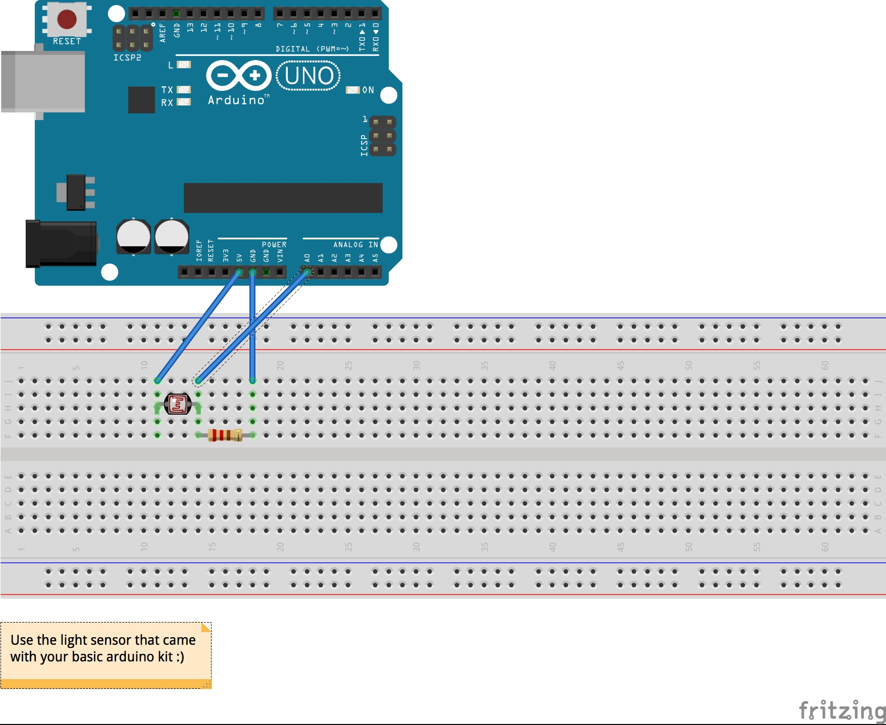

#Week 7

Demo week! Yeah! 

***there will me more here tomorrow!*** 

Topics: Getting analog data from Arduino, Sound generation and the ofxTonic add on. 

Assignment: Get caught up if you're behind and work on your final project for my class. If you have a mac, you can play with ofxTonic 

Today we are going to make the electronics in this: 

<https://drive.google.com/file/d/0B6F-w7wii4Dlcmp0VkxXVGtZVGM/view?usp=sharing>

More specifically, we are going to make a version with just one sensor: 

https://vimeo.com/112406019

It's a light sculpture you can play with a flashlight. The brighter the light on it, the higher the synth notes oF will play.  

We are going to give a try to the ofxTonic addon and link it up to a light sensor in Arudino. Don't forget, I expect you to have Standard Firmata installed on your Arduino from the Arduino library. Load it up now if you're not currently running it. 

First off, let's build some hardware! 

Let's hook up a light sensor, resistor and Arduino. 

 

Next you'll need the ofxTonic addon. This part of today is only going to really work for Mac people. Sorry windows people. Next week they'll feel your pain for kinect. For this week, you'll need to do your work in a lab at HKU. :( 
<github: https://github.com/TonicAudio/ofxTonic>

Add this file to your addons folder in your open frameworks folder. Now run the oF project generator and click on addons. You can check ofxTonic. Generate a new project for yourself with it. 
 
I've done my best to note this code heavily. Read the notes now and try it for yourself. 

Now open up the project on github called Week 7
<https://github.com/phoenixperry/Interactive_Development_in_Open_Frameworks/tree/master/Week7> 

###ofxTonic 
ofxTonic is an FM synth. 
You create control parameters which are like knobs on a keyboard. You can control these knobs in real time. It's very fun indeed. 

To learn more about FM synths and audio in general check this out: 
<https://www.propellerheads.se/blog/tutorials/thor-demystified-9-an-introduction-to-fm-synthesis-part-1/> 
<http://www.soundonsound.com/sos/apr00/articles/synthsecrets.htm> 
